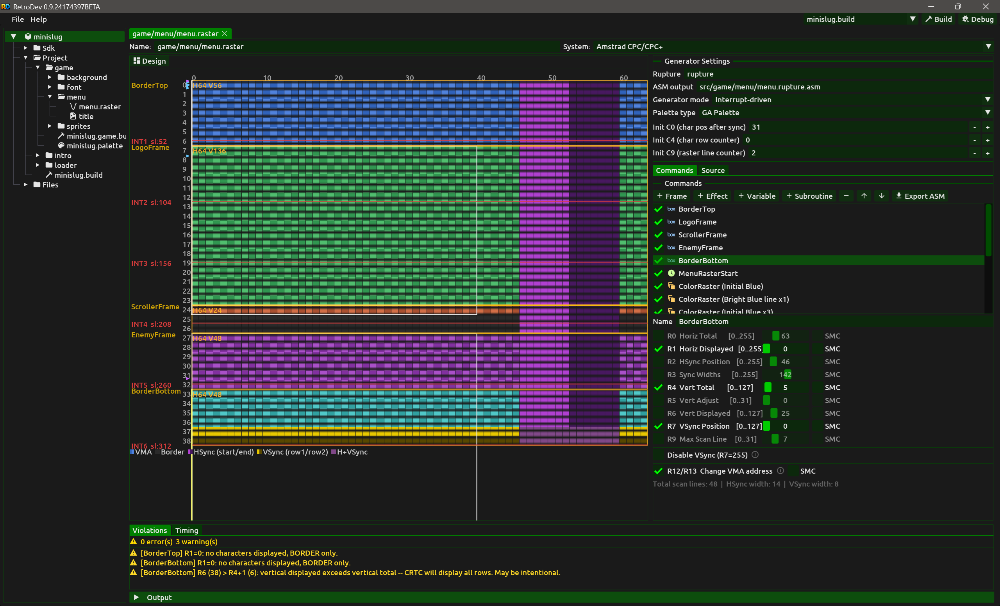
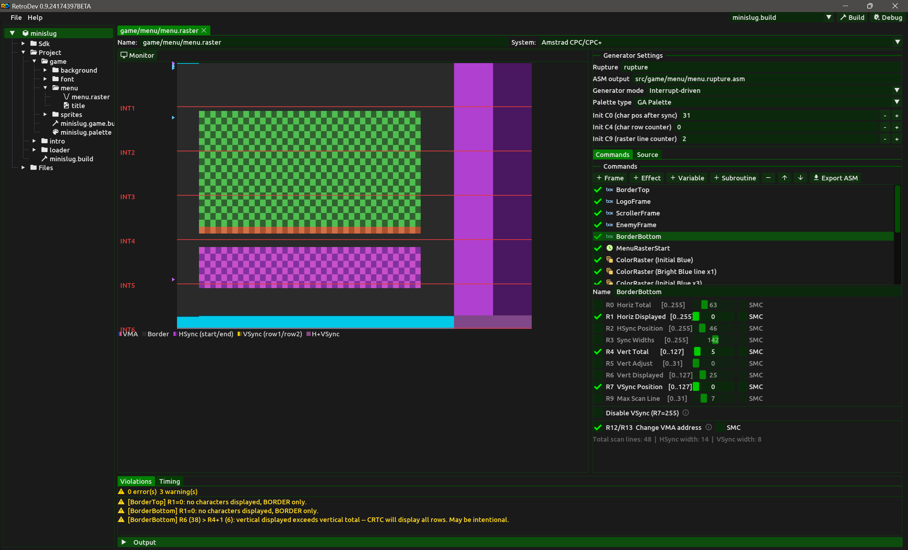
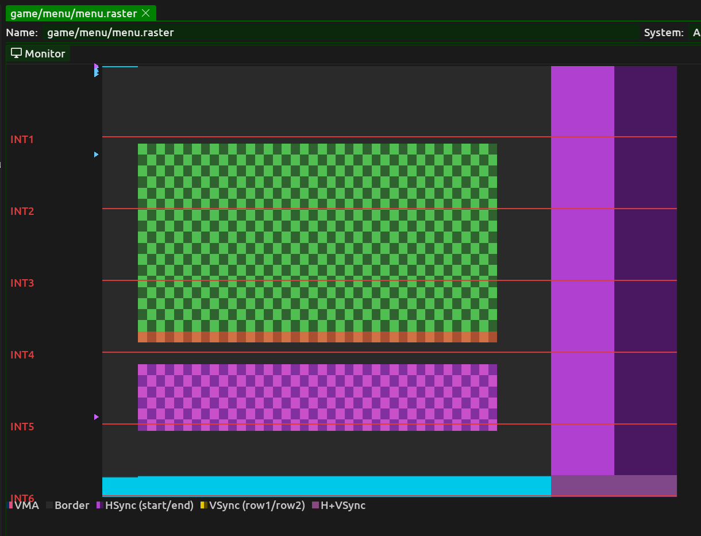
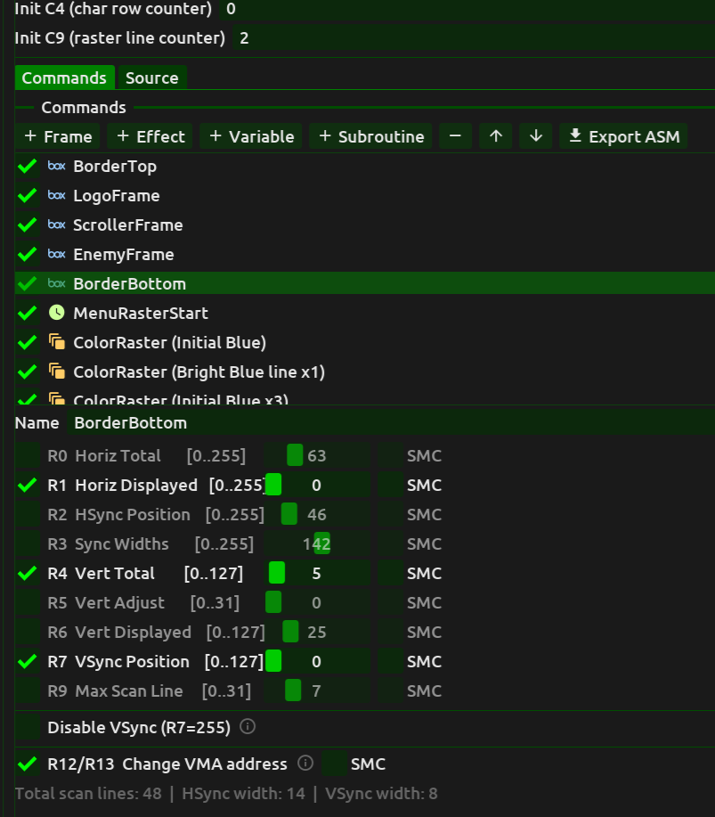
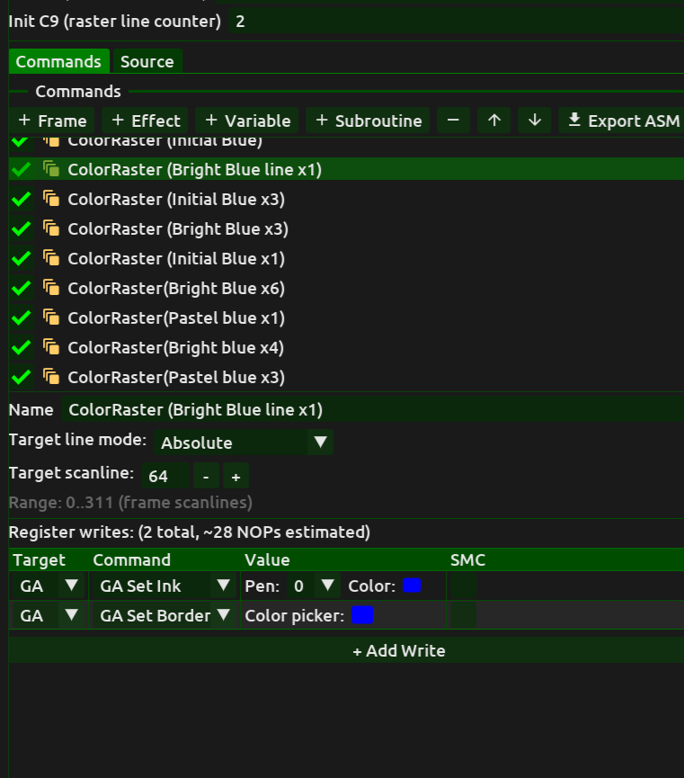
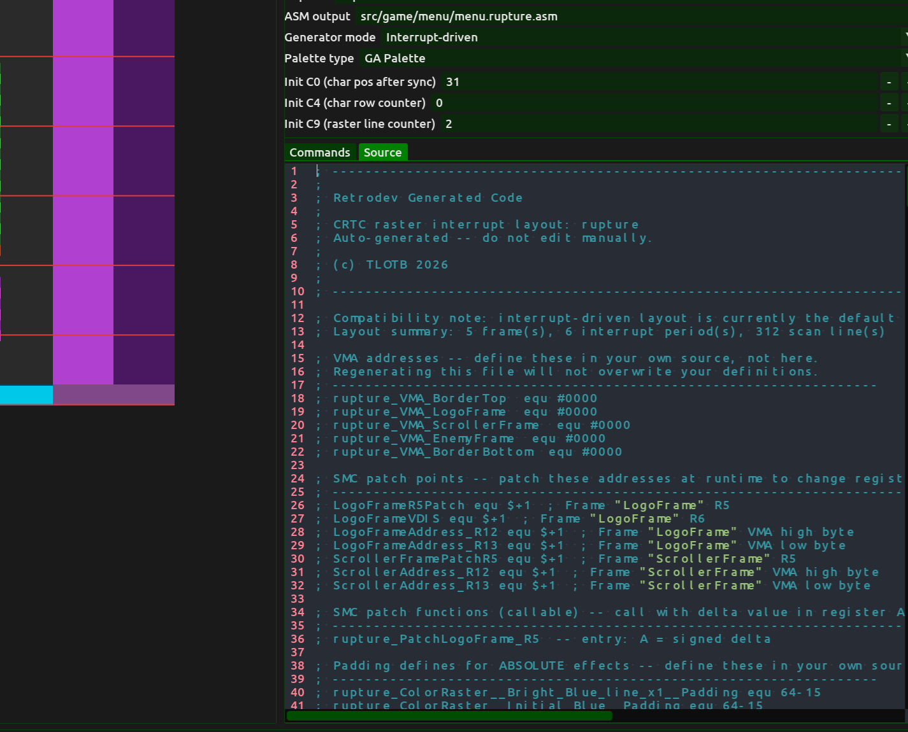

# Raster Effects Editor (Amstrad CPC)

> **Target system:** This raster effects editor targets the **Amstrad CPC** only. Raster generators for other systems will be added as system support is extended.

A **Raster** project item defines a hardware raster effects sequence for the Amstrad CPC. You describe what should happen on screen at each scanline, Retrodev validates the timing against CPC hardware constraints in real time, and when you are ready you export the Z80 assembly code with a single click, producing an optimized handler ready to include in your build.

Raster effects work by writing to CRTC and Gate Array registers at precise scanline boundaries mid-frame, changing colours, borders, screen positions or other hardware state between character rows. Even a small shift in a CRTC register value at the right moment can produce the overscan borders, colour splits and scrolling effects that define the Amstrad CPC demo and game aesthetic.

## Creating a raster project item

1. In the **Project** panel, right-click any folder or the panel background.
2. Select **Add raster effects** from the context menu.
3. Retrodev creates the item with a default single Frame command and opens the editor.
4. Configure the frame parameters and add Effect commands for scanline-level changes. The violations panel updates in real time as you work.
5. When the setup is correct and free of violations, click **Export ASM** to write the Z80 assembly output file.

## Editor layout

The raster editor is divided into three areas:

- **Visualizer** (left) — shows a schematic or pixel-accurate view of the CRTC frame, colour-coded by region and register-write slot.
- **Command editor** (right) — the list of raster commands and the register values for the selected command.
- **Violations** (bottom) — a list of timing constraint violations detected by the CRTC simulator after the last generation.

## Visualizer

The visualizer on the left shows the CRTC frame currently defined by the Frame command. Two display modes are available via the toggle at the top of the panel:

**Grid mode** — a schematic block diagram of the frame divided by character row. Each horizontal band represents one character row (8 scanlines tall). The bands are colour-coded:

- White — active display area (visible pixels).
- Grey — border area outside the active display.
- Purple — horizontal sync region.
- Cyan — vertical sync region.
- Coloured markers — scanlines where an Effect command writes one or more registers.

**Monitor mode** — a pixel-accurate RGBA rendering of the full frame as the CRT would display it, simulated at character-clock resolution. Each pixel represents one CPC clock unit. The active display area shows a checker pattern per interrupt slot to visualize the slot boundaries. Border regions are drawn in their actual Gate Array border colour.

## Commands

The command editor lists the raster commands that make up the effect. Commands execute in the order the hardware encounters them during the frame. The list always begins with exactly one **Frame** command that defines the CRTC frame timing; Effect, Variable and Subroutine commands follow in scanline order.

To add a command, click the **+** button above the list and select the command type. To remove the selected command, click **−**. The Frame command cannot be removed.

### Frame command

The Frame command defines the complete CRTC register configuration for the frame. It sets the fundamental hardware timing — total scanlines, horizontal and vertical sync positions, active display window size and screen memory address — from which all effect timings are computed.

The following CRTC registers are available. Each register corresponds directly to the 6845 CRTC hardware register of the same name:

| Register | Name | Description |
|---|---|---|
| R0 | Horizontal Total | Total character columns per scanline (minus 1). Determines the absolute horizontal timing of the frame. |
| R1 | Horizontal Displayed | Number of character columns in the active display area. |
| R2 | Horizontal Sync Position | Character column at which HSync begins. |
| R3 | Sync Widths | HSync and VSync widths packed into one byte (low nibble = HSync, high nibble = VSync). |
| R4 | Vertical Total | Total character rows per frame (minus 1). Determines the vertical height of the frame. |
| R5 | Vertical Total Adjust | Extra scanlines added after the last full character row to fine-tune the total frame height. |
| R6 | Vertical Displayed | Number of character rows in the active display area. |
| R7 | Vertical Sync Position | Character row at which VSync begins. |
| R9 | Max Raster Address | Number of scanlines per character row (minus 1). Normally 7 for 8-scanline rows. |
| R12/R13 | Start Address | 14-bit screen memory start address, split across two registers. Affects which region of RAM is displayed on screen. |

For each register you can enable or disable the write using the checkbox next to it. Disabled registers are not written at frame start and retain whatever value the hardware already holds. This is useful for registers managed at runtime by your program rather than by the raster handler.

**VSync suppression** — when enabled, the raster handler suppresses the hardware VSync interrupt by writing R7 to a value that prevents VSync from firing. This is used in overscan setups where the interrupt timing must be managed manually.

**Self-modifying code (SMC) patching** — each register can be marked for SMC patching. When marked, the generated code inserts a named label at the byte that holds the register value in the assembled output, allowing your program to patch that value at runtime. An optional user-defined label name overrides the auto-generated one. The **Patch function** option (currently available for R5) generates a helper routine that applies the patch and handles the hardware-specific update sequence safely.

### Effect command

An Effect command writes one or more CRTC or Gate Array registers at a specific scanline during the frame. This is the core mechanism of raster effects: changing a register mid-frame causes the hardware to immediately reflect the new value for all subsequent scanlines.

**Target scanline** — the scanline at which the register writes are scheduled:

- **Absolute** — a fixed scanline number counting from the top of the frame (0 = first scanline after frame start).
- **Relative** — an offset from the scanline of the previous Effect command. Useful for sequences of effects whose relative spacing matters but whose absolute position may shift.

Each Effect command holds a list of register writes. Click **+** within the write list to add a register write, or **−** to remove the selected one.

For each register write, select the **target** (CRTC or Gate Array) and the **register**:

**CRTC registers** — same set as the Frame command (R0–R9, R12/R13). Writing a CRTC register mid-frame takes effect immediately at the next character clock boundary.

**Gate Array registers:**

- **Set Ink** — sets the hardware colour for a specific pen. Select the pen number (0–15 for Mode 0, 0–3 for Mode 1, 0–1 for Mode 2) and the hardware colour from the picker, which shows the 27 available GA hardware colours.
- **Set Border** — sets the border colour. One write affects the border for the current and all subsequent scanlines until the next border write.
- **Set Mode** — changes the screen mode. Switching mode mid-frame is an advanced technique used to mix pixel widths on the same screen.

Each write can optionally be marked for **SMC patching**, inserting a named label at the value byte so your program can modify the colour or register value at runtime.

### Variable command

A Variable command writes a known value to a named memory location at a specific scanline. This is used to signal runtime state from the raster handler to the rest of the program — for example, setting a byte to 1 when the handler reaches a particular scanline so that game logic can synchronize to the raster position without polling.

- **Variable name** — the suffix of the generated label. The full label in the output code is formed from the rupture name prefix and this suffix.
- **Value** — the byte value written at runtime (typically 1).
- **Target scanline** — the scanline at which the write occurs.
- **Unrestrained** — when enabled, the timing constraint for this write is relaxed. The write is still scheduled at approximately the target scanline but is not required to meet the exact NOP-level budget of the surrounding slot.

### Subroutine command

A Subroutine command inserts a `CALL` instruction to a user-defined Z80 routine at a specific scanline. Use this when the raster handler needs to execute logic that is too complex or too variable to express as fixed register writes — for example, a routine that reads a table entry and writes different colour values each frame.

- **Subroutine name** — the assembly label of the routine to call. The generated code emits `CALL subroutineName` at the scheduled scanline.
- **Target scanline** — the scanline at which the call is scheduled.

> **Note:** the subroutine runs from within the raster interrupt handler and must return before the next scheduled write deadline. Retrodev cannot determine how long the routine will take — ensuring it fits within the available budget is the responsibility of the caller.

## Code generation

Click **Export ASM** to generate the complete Z80 assembly code for the raster handler and write it to disk. The output path for the file is configured in the **Output path** field. Once exported, the file can be included directly in your build's assembly source list.

The **Source** tab in the command editor panel shows a preview of what will be exported, updated as you edit the command list so you can inspect the code before committing to disk.

The generator produces:

- CRTC and Gate Array register writes at exactly the right NOP offset within each interrupt slot.
- NOP padding where hardware timing requires idle cycles.
- Wait loop sequences between register write groups.
- Self-modifying code labels at every register value marked for patching.
- Constant-register hoisting — registers whose values do not change between Effect commands are written once at frame start rather than on every interrupt.
- Redundant-write elision — if the generator can prove a register already holds the required value, the write is omitted entirely.

**Rupture name** — the label prefix used for all generated symbols. All labels in the output code are prefixed with this string, so multiple raster handlers can coexist in the same project without label collisions.

## Timing report

The timing panel below the command list shows the NOP budget breakdown for each interrupt slot in the frame. For each slot the following is reported:

- **Overhead** — fixed NOPs consumed by the interrupt handler setup and teardown.
- **Wait** — NOPs spent idle between effect groups (wait loops between non-adjacent Effect commands).
- **Active** — NOPs used by actual register writes and variable writes.
- **Free** — NOPs remaining in the slot available for your subroutine commands or other inline code.
- **Elided** — NOPs recovered by the generator's redundant-write elimination.

If a slot's total consumed NOPs exceed the slot budget, it is highlighted in red and a corresponding violation appears in the violations panel below.

## Violations

The violations panel lists every timing or constraint error detected by the CRTC simulator after the last code generation. Each entry shows:

- The command that caused the violation, or *global* for frame-level errors.
- A description of what constraint was violated — for example, a register write scheduled before the hardware is ready to accept it, or a slot that consumes more NOPs than its budget allows.

Errors (red) indicate that the generated code will not function correctly on hardware. Warnings (yellow) flag conditions that may work on some CRTC variants but not others.

Click any violation entry to select the corresponding command in the command list.

## Configuration

The following settings are available in the configuration area of the editor:

- **Rupture name** — the label prefix for all generated code symbols.
- **Output path** — optional disk path for the automatically written assembly output file.
- **Generator mode** — selects the raster timing strategy:
  - **Interrupt Driven** — the handler runs on the Z80 interrupt and uses the 6 fixed 52-scanline interrupt slots to schedule all register writes. This is the standard mode for CPC raster effects.
  - **Timed Raster Loop** — a free-running loop with explicit wait instructions. Used for effects that require finer control over timing outside the interrupt structure.
- **Initial CRTC counters** — specifies the known state of the CRTC hardware counters at the moment the interrupt handler is entered, immediately after VSync. These values (C0, C4, C9, C5 and related counters) tell the timing simulator where in the CRTC cycle execution begins, so it can schedule register writes accurately from that starting point. The generated code targets all CRTC types.
